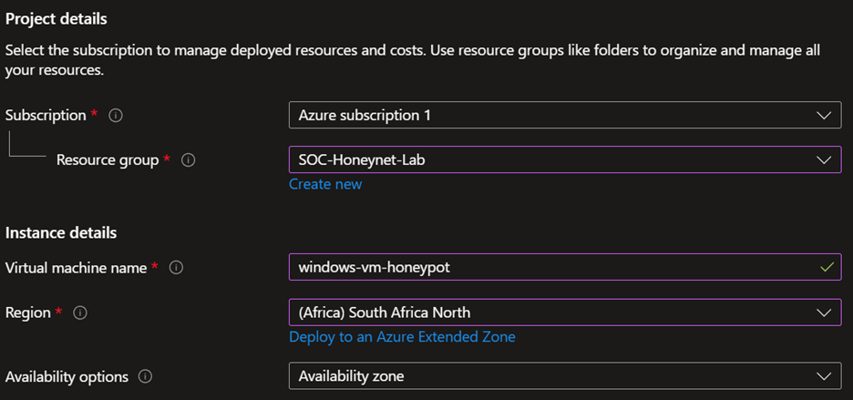

# Azure-SOC-Honeynet-Lab
A live SOC environment built in Azure using Microsoft Sentinel to detect and analyse real-world cyber attacks

In this lab I deployed a live honeynet in Microsoft Azure by configuring a deliberately vulnerable Windows virtual machine exposed to the public internet. The environment was integrated with Microsoft Sentinel via a Log Analytics workspace and Data Collection Rule to ingest and analyse real-world security events. I configured a brute force detection analytics rule mapped to the MITRE ATT&CK framework, built a geolocation watchlist for IP enrichment, and connected the environment to Microsoft Defender XDR. The objective was to simulate a real SOC environment, detect live attack activity through KQL queries and custom analytics rules, and develop hands-on experience with cloud-native SIEM tooling relevant to a Security Operations Analyst role

### VM Creation

*The Standard_D2ls_v5 size was selected after the B1s was unavailable in South Africa North for free tier subscriptions.*
